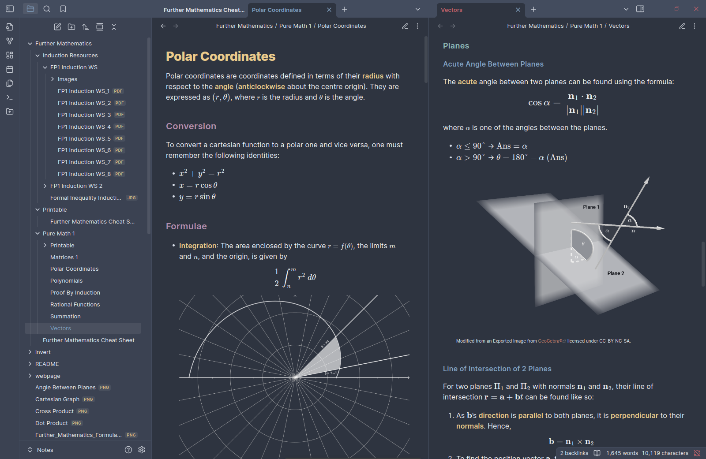
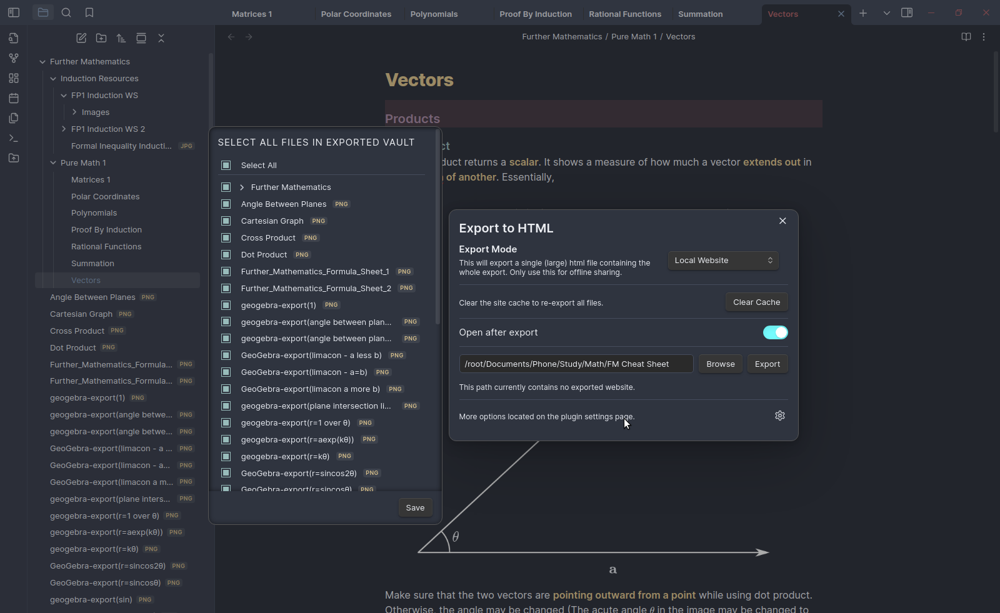
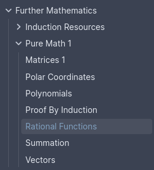
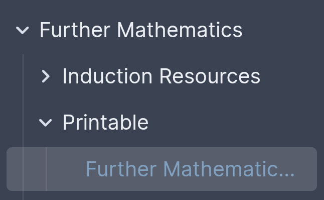
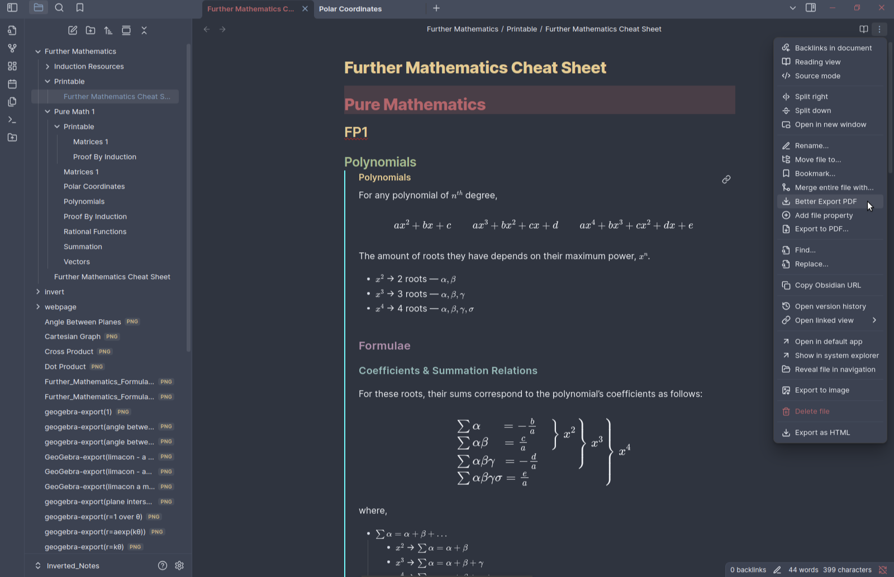
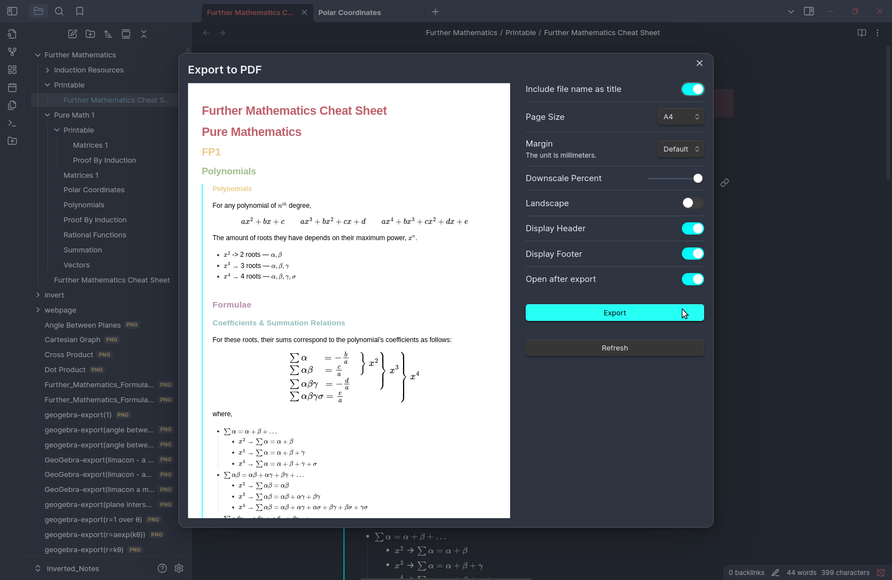

This is an Obsidian Repository containing my cheat sheets for Further Maths. These can be converted into webpages or pdfs for ease of use.

# Conversion to Other Formats
## Webpage
To convert into a webpage,
- Make sure you have `python3` installed. Make sure that the parent folder you cloned this repository into is blank or at least doesn’t have the `/Webpage_Notes` directory.
- Open a command line in the `/webpage` directory. Alternatively, `cd` into it. For example, from the root of this folder, you can use:
	```
	cd ./webpage
	```
- Run the following command:
	```
	python webpage.py
	```
- Open the Obsidian Vault generated in the repository’s parent folder, `/Webpage_Notes`
- Open every single file inside `/Further Mathematics/Pure Math 1`. For each file, scroll all the way down, then all the way up to load the files. This ensures accurate rendering.
- Use <kbd>Ctrl</kbd> + <kbd>P</kbd> to open the Command Palette. Select the `Webpage HTML Export: Select Export Settings` option and select all files. Then, click the `Export` button.
	
- The resulting `html` file will have the different topics in their respective folders that you can click to see:
	

## PDF
To convert into a pdf file,
- Make sure you have `python3` installed. Make sure that the parent folder you cloned this repository into is blank or at least doesn’t have the `/Inverted_Notes` directory.
- Open a command line in the `/invert` directory. Alternatively, `cd` into it. For example, from the root of this folder, you can use:
	```
	cd ./invert
	```
- Install the required dependency (`opencv-python==4.6.0.66`):
	```
	pip install -r requirements.txt
	```
- Run the following command:
	```
	python invert.py
	```
- Open the Obsidian Vault generated in the repository’s parent folder, `/Inverted_Notes`
- Open the printable cheat sheet at `/Further Mathematics/Printable`.
	
- Open $\vdots$ (the three-dot menu) and select `Better Export PDF` to open a dialogue for exporting the pdf.
	
- Wait for the PDF Preview to render, and then click `Export` to export the pdf.
	